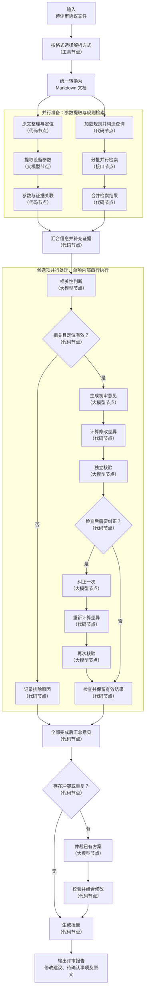

# 技术协议智能评审工作流

输入待评审协议文件，统一解析为 Markdown 后，结合业务规则完成评审，输出修改建议、待确认事项及对应原文。

参数提取与规则检索并行执行；候选项并行处理，单项内部串行执行。每项最多纠正一次，全部候选完成后汇总。图中省略关键词入库等辅助支线。

```mermaid
flowchart TD
    A["输入
待评审协议文件"]
    A --> B["按格式选择解析方式
（工具节点）"]
    B --> C["统一转换为
Markdown 文档"]
    subgraph PREP["并行准备：参数提取与规则检索"]
        D["原文整理与定位
（代码节点）"]
        D --> E["提取设备参数
（大模型节点）"]
        E --> F["参数与证据关联
（代码节点）"]
        G["加载规则并构造查询
（代码节点）"]
        G --> H["分批并行检索
（接口节点）"]
        H --> I["合并检索结果
（代码节点）"]
    end
    C --> D
    C --> G
    F --> J["汇合信息并补充证据
（代码节点）"]
    I --> J
    subgraph REVIEW["候选项并行处理，单项内部串行执行"]
        K["相关性判断
（大模型节点）"]
        K --> L{"相关且定位有效？
（代码节点）"}
        L -->|否| M["记录排除原因
（代码节点）"]
        L -->|是| N["生成初审意见
（大模型节点）"]
        N --> O["计算修改差异
（代码节点）"]
        O --> P["独立核验
（大模型节点）"]
        P --> Q{"检查后需要纠正？
（代码节点）"}
        Q -->|是| R["纠正一次
（大模型节点）"]
        R --> S["重新计算差异
（代码节点）"]
        S --> T["再次核验
（大模型节点）"]
        T --> U["检查并保留有效结果
（代码节点）"]
        Q -->|否| U
    end
    J --> K
    M --> V["全部完成后汇总意见
（代码节点）"]
    U --> V
    V --> W{"存在冲突或重复？
（代码节点）"}
    W -->|有| X["仲裁已有方案
（大模型节点）"]
    X --> Y["校验并组合修改
（代码节点）"]
    W -->|无| Z["生成报告
（代码节点）"]
    Y --> Z
    Z --> OUT["输出评审报告
修改建议、待确认事项及原文"]
```
